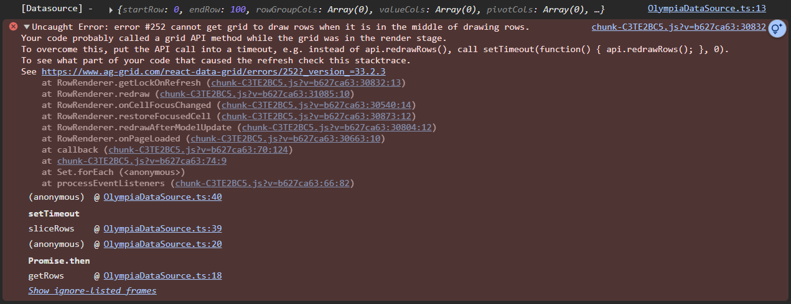

# ag-grid-issue-report

## How to reproduce the issue with ag-grid

- add .env file with the following content

```env
AG_GRID_KEY=<your ag-grid key>
```

- `npm install`
- `npm run dev`
- open http://localhost:5173
- open dev tools
- click on the button "Refresh"
- right click on spinner of loading row indicator

!!! ERROR Uncaught Error: error #252 cannot get grid to draw rows when it is in the middle of drawing rows.
Your code probably called a grid API method while the grid was in the render stage.
To overcome this, put the API call into a timeout, e.g. instead of api.redrawRows(), call setTimeout(function() { api.redrawRows(); }, 0).
To see what part of your code that caused the refresh check this stacktrace.



This error is caused by the ag-grid library when the grid ends the loading row indicator.

By the version 33.1.0 the error is not present.

```json
"ag-grid-community": "33.1.1",
"ag-grid-enterprise": "33.1.1",
```
